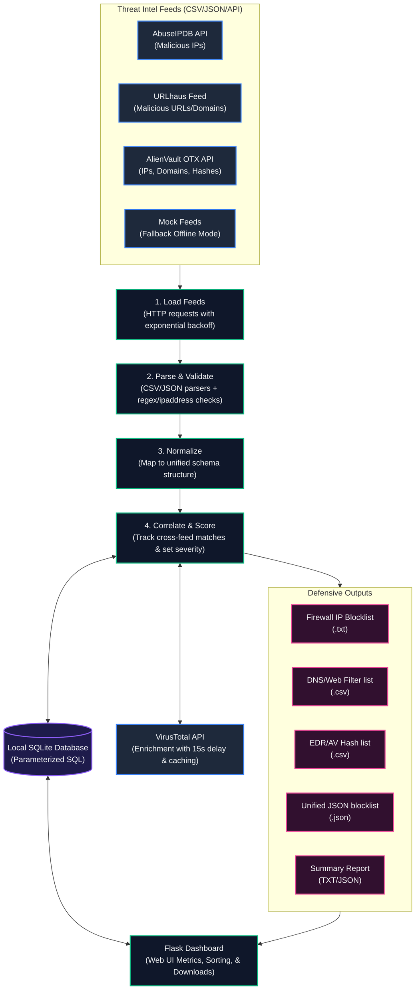

# ThreatWeave - Architecture

The system aggregates Indicators of Compromise (IOCs) from multiple feeds, validates and normalizes them, correlates occurrences to determine severity, enriches them with threat intelligence metadata, and generates defensive outputs (blocklists and summaries).

## Pipeline Flow

## Description of Pipeline Components

1. **Load Feeds**: Triggers HTTP requests to active feeds. Built-in retry logic executes up to 3 times with exponential backoff on network failures or 429 status codes. If a feed is offline, the pipeline proceeds with other active feeds and marks the status as partially successful.
2. **Parse & Validate**: Checks syntax (e.g. valid IP addresses using the `ipaddress` module, hash formats, URLs) and discards duplicate or malformed items to prevent database pollution.
3. **Normalize**: Maps data from diverse sources into a standard format containing: `value`, `ioc_type`, `source`, `category`, `first_seen`, and `raw_data`.
4. **Correlate & Score**: Aggregates normalized entries. Calculates severity based on feed overlap:
   - **High**: Found in 3+ sources.
   - **Medium**: Found in 2 sources.
   - **Low**: Found in 1 source.
5. **VirusTotal Enrichment**: Queries VT to enrich hashes, IPs, or URLs. Enforces a 15-second delay between queries and checks a local SQLite cache first to avoid hitting public API limits (500 requests/day).
6. **SQLite Database**: Stores raw records, cached VT lookups, and correlated metrics safely using parameterized SQL queries.
7. **Blocklist Generator**: Extracts High and Medium severity IOCs, splitting them into format-specific outputs for ingestion by security controls (Firewalls, Proxies, EDR).
8. **Flask Dashboard**: Renders key SOC metrics, displays a sortable table of threats, and hosts blocklist download controls.
